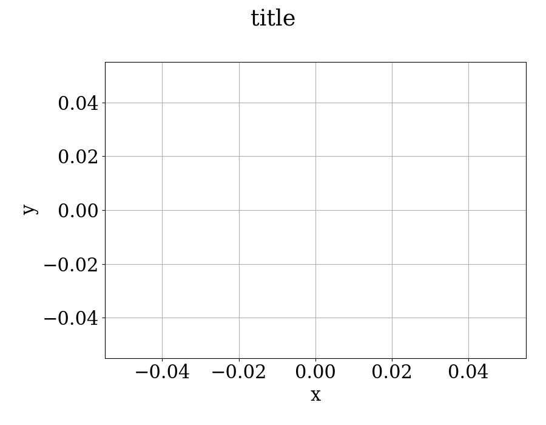

```python
Plotter.new_plot(
    xlabel,
    ylabel,
    title,
    size=(9, 7)
)
```

## Parameters

**xlabel: str**

- The name of the x-axis.

**ylabel: str**

- The name of the y-axis.

**title: str**

- The title of the plot.

**size: tuple[int, int]**

- The size of the plot window.

## Example

```python
Plotter.new_plot("x", "y", "title")
```

## Result



:::info
You can use Tex notation in the `xlabel`, `ylabel`, and `title` parameters. Here's an example:

```python

Plotter.new_plot(
    r"$\rho$",
    r"$\eta$",
    "LaTex labels"
)
```

which results in:


:::
