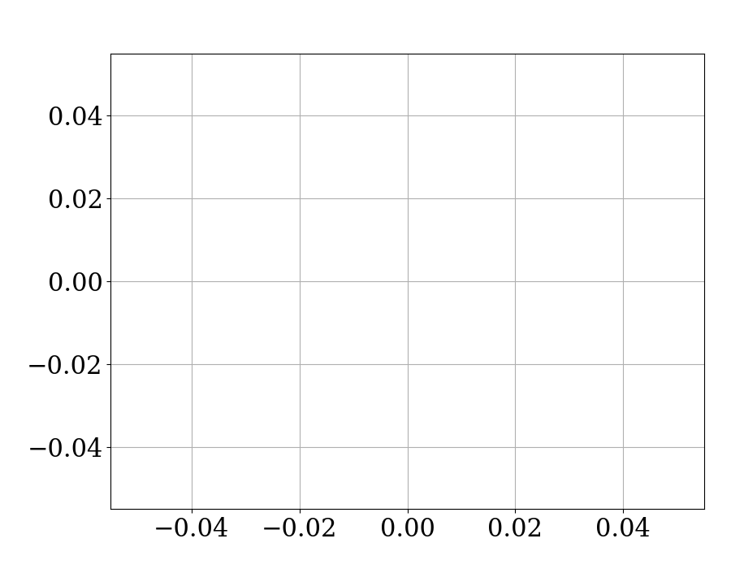

```python
Plotter.start_session()
```

This method needs to be called at the beginning of your script when you are going to use the `Plotter` class.

## Example

```python
from quyckplot import Plotter

Plotter.start_session()
```

## Result

By default, `Plotter.start_session` sets styles so that the plots look like this:


